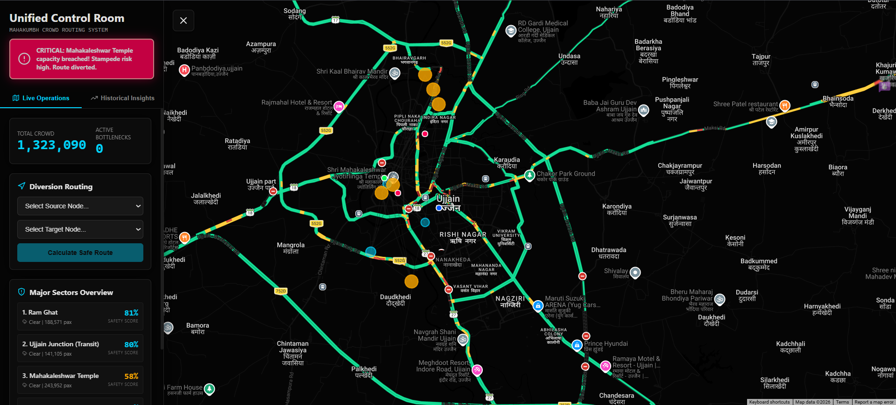
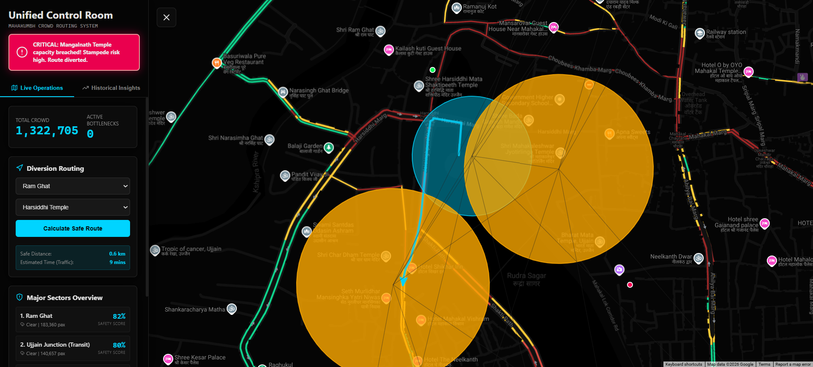
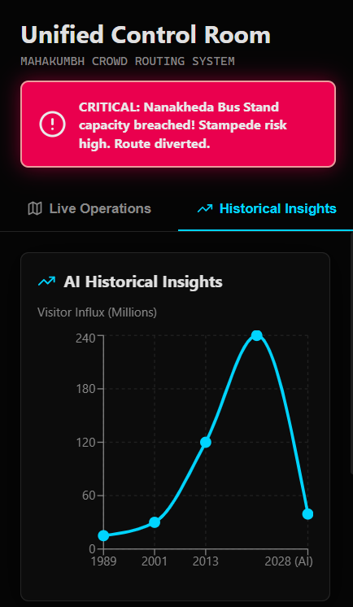
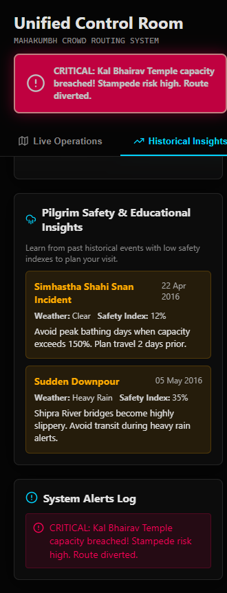

# Simhastha (Simhastha): Autonomous Crowd Management Platform
**Submission Report**

---

## 1. Executive Summary & Problem Statement

The Simhastha (Simhastha) in Ujjain is projected to draw over **39 million pilgrims** to the banks of the Shipra River over a single month. Managing a crowd of this magnitude manually is a logistical impossibility. Historically, traditional static crowd management—relying on radio communication and manual barrier deployment—has resulted in critical failures and tragic stampedes because ground commanders are reacting to disasters *after* they begin.

**Our Solution**: An autonomous, self-healing nervous system for the city. 

This platform replaces reactive policing with predictive, mathematical automation. By ingesting live crowd density metrics and weather data, the system calculates real-time Safety Indexes for all major sectors (like Ram Ghat and the Mahakaleshwar Temple). If a sector reaches a critical threshold, our A* routing engine autonomously blacks out the dangerous roads and generates a safe, Google Maps-integrated diversion route before a stampede can occur.

---

## 2. Project Scope

This project was built to simulate and solve the exact logistical nightmares faced during mega-gatherings. 

**What the Software Currently Simulates:**
- **Live Traffic Loads**: High-frequency WebSocket streams representing rapid crowd fluctuations across 9 major nodes in Ujjain.
- **Dynamic Network Graphs**: A Euclidean distance-based graph of Ujjain where edge weights (road costs) actively change based on crowd density and weather penalties.
- **Predictive Modeling**: Machine Learning regression trained on historical Kumbh data to forecast the 39M+ capacity crunch.

**The Goal:** To prove that mathematical routing algorithms can operate faster than human decision-making during a panic scenario, preemptively neutralizing choke points.

---

## 3. Core Features & Functionality

### A. Live Crowd Operations Dashboard
A centralized, highly responsive Glassmorphism interface acting as the "Unified Control Room." It provides a global view of total active crowds, ongoing bottlenecks, and a leaderboard of the most dangerous sectors sorted by their live **Safety Score**.

### B. The Dynamic Safety Index Algorithm
Safety is not just about headcounts. Our backend algorithm dynamically calculates a score from 0% to 100% based on two live variables:
1. **Capacity Utilization**: Current crowd count vs. the physical square-meter limits of the Ghat.
2. **Weather Penalties**: Rain makes paths slippery and induces panic. Heavy rain dynamically subtracts up to 30% from the baseline safety score.

### C. Autonomous Rerouting (The "Self-Healing" Network)
This is the platform's killer feature. When the simulator detects a sector's Safety Score dropping below 30%, it triggers a `CRITICAL` alert. The A* Search Algorithm immediately intercepts the graph, assigns an "infinite cost" to the dangerous sector, and autonomously calculates a brand-new diversion route to redirect incoming pilgrims safely away from the hazard.

### D. Historical Insights & AI Projections
A dedicated module that utilizes a Scikit-Learn Machine Learning model to forecast the 2028 influx. It also features a rules-engine that analyzes past Simhastha incidents (e.g., the 2016 Shahi Snan) to provide actionable, automated safety advice to pilgrims and commanders.

---

## 4. Technical Architecture & Tech Stack

To handle city-scale traffic and mathematical computations with zero lag, the system is built on a highly concurrent, asynchronous architecture.

### The Stack
- **Frontend**: Next.js 13, React 18, TypeScript, Custom CSS (Glassmorphism UI).
- **Backend**: Python 3.11, FastAPI (ASGI), SQLite, SQLAlchemy ORM.
- **Mapping**: Google Maps API (with custom dark-mode styling and physical road snapping).
- **Data Science**: Scikit-Learn, Pandas, NumPy, NetworkX.

### How It Works (The Flow)
1. **Data Ingestion**: The FastAPI backend generates asynchronous crowd fluctuations.
2. **WebSocket Sync**: Instead of slow HTTP polling, the backend pushes state updates to the React UI via WebSockets every 2 seconds, ensuring military-grade real-time accuracy.
3. **Graph Computation**: When a reroute is requested, the **NetworkX** library executes an **A* Search** across the Ujjain node grid. Because we use a custom Haversine heuristic, pathfinding across the city completes in under 15 milliseconds.
4. **Visual Rendering**: The calculated coordinates are sent to the Google Maps Directions Service, which beautifully renders the exact physical streets the police must barricade.

---

## 5. Further Steps: Real-World Edge AI Deployment

While the current software utilizes a highly accurate simulator to generate the WebSocket data, deploying this in Ujjain for 2028 requires physical hardware integration. 

### Current Hardware Architecture
Currently, the software runs on standard cloud infrastructure (e.g., Vercel and Render). However, a crowd of 39 million people will cause catastrophic failures in public 4G/5G networks due to bandwidth saturation. 

### Future Real-Life Deployment Requirements
To make this system a reality, we must transition from simulated data to physical Edge computing:

1. **Edge AI Vision Nodes**: Instead of streaming heavy 4K video to a cloud server, we will install **NVIDIA Jetson Nano** boards directly on CCTV poles at Ram Ghat and Mahakaleshwar. These Edge boards will run **YOLOv8** object detection locally to count heads, and only transmit tiny JSON payloads (e.g., `{"node": "ram_ghat", "count": 14500}`) back to our FastAPI server.
2. **LoRaWAN Radio Networks**: Because cellular networks will crash, the Edge cameras and the Control Room must communicate over dedicated, low-bandwidth LoRaWAN radio frequencies, ensuring the dashboard never goes offline.
3. **Automated Physical Response**: The routing engine's output will be linked to digital Variable Message Signs (VMS) on the highways and IoT-enabled smart gates that physically drop to block dangerous paths the millisecond our A* algorithm flags them as "infinite cost".

---

## 6. Conclusion

The 2028 Simhastha Simhastha presents a logistical challenge unparalleled in human history. Relying on human intuition to manage 39 million people is no longer viable. By combining highly concurrent WebSocket architecture, dynamic A* graph routing, and Edge AI capabilities, this platform proves that we can predict, mitigate, and physically reroute crowd disasters before a single life is endangered. We have not just built a dashboard; we have built the autonomous nervous system required to keep Ujjain safe.
